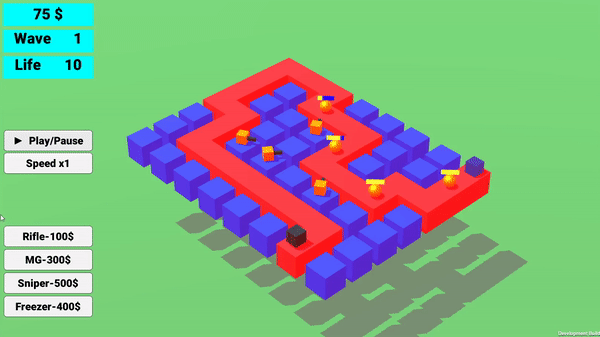
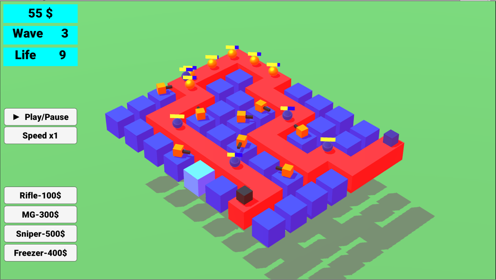
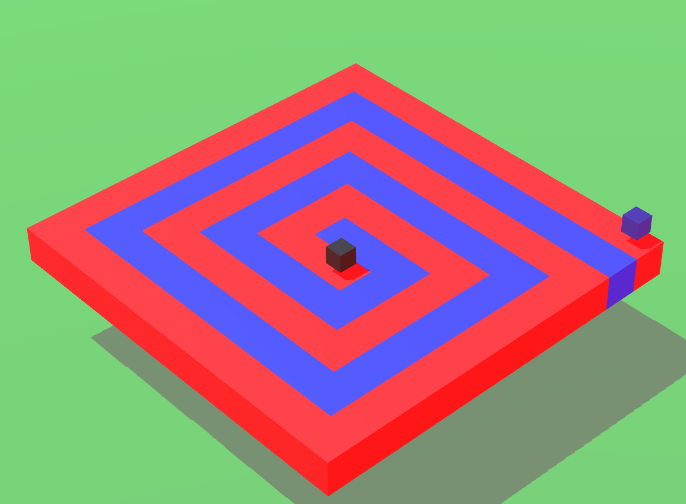
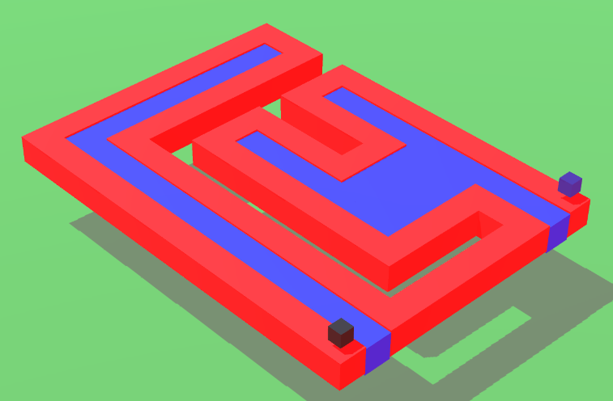
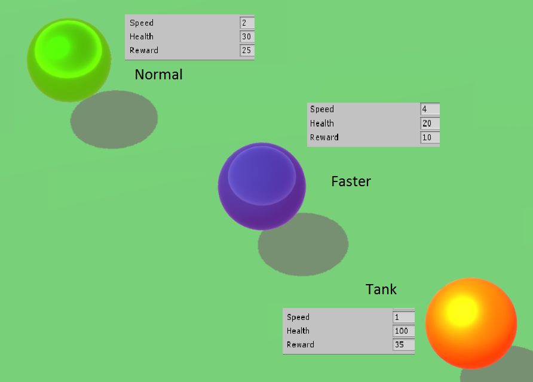

# TowerDefense3D-Unity

## Introduction
A Simple 3D TowerDefense-Game made as a graduation  project.

## Technologies: 
- Unity Version 5.5.0f3
- C# as scripting language

## Features
- 3 different levels (can choose on startup)
- individual turret types
- different enemies
- multiple enemy waves
- levels with increasing difficulty
- win/lose condition

## Gallery
---

---
## Development
Describing the set goals for the projects, the problems which occurred during implementation and a conclusion on which goals were reached.

### Goals

#### Main Goals
1. completely playable game with and "end"
1. using a model-view-controller 
2. fun gameplay 

#### Additional Goals
1. sfx and music
1. particle effects (shooting, hitting, etc)
1. 3d models for enemies, turrets, bullets

### Problems
1.  *using a model-view-controller*: was easy to maintain at the beginning but with growing project size it became harder. This resulted that some scripts became too large and adding new features very tedious. 

2. *project documentation*: The goals and features of the projects weren't so clearly defined at the beginning, this lead to feature creep. Also a not so thorough commenting of the code, at the beginning, lead to slower development, when returning to the project. This was fixed with an description on every script and detailed comments on the most complicated parts.

3. *bugs*: With the increasing number of systems which have to work together, the number of bugs grew. This increased development time. Most of them were fixed so the game could be more than playable, but some still remain.

4. *fun gameplay*: This goal was very time consuming, because finding the balance between an too easy/hard challenge, required a lot of tweaking of different setting. 

### Conclusion
The main goals of the game were reached but with the problems listed above, there wasn't any time left to add the additional goals. These would have made the game look more polished. 

 
